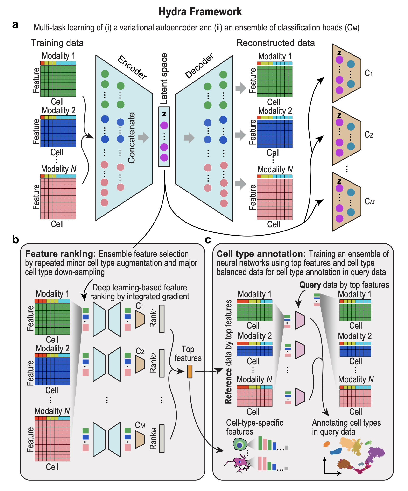

# 📖 Documentation 

    Thank you for using <code>Hydra</code>, an interpretable deep generative tool for single-cell omics.

    If you find a bug or encounter any issues running the tool, please open an issue on <a href="https://github.com/SydneyBioX/Hydra" target="_blank">GitHub</a>, and we will get back to you as soon as possible!!

 

  

 

---

  Documentation by <a href="http://manojmw.github.io" target="_blank">Manoj M Wagle</a>

