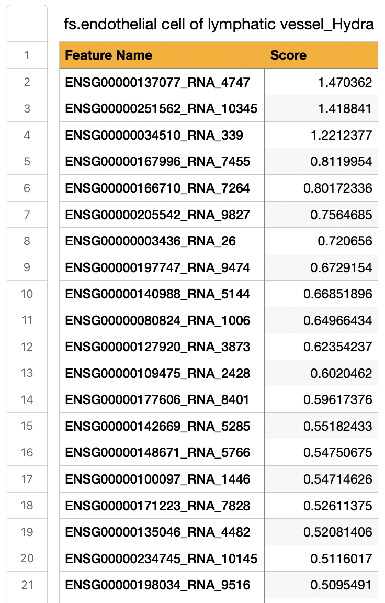
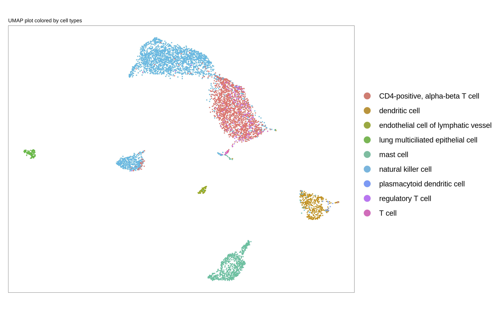
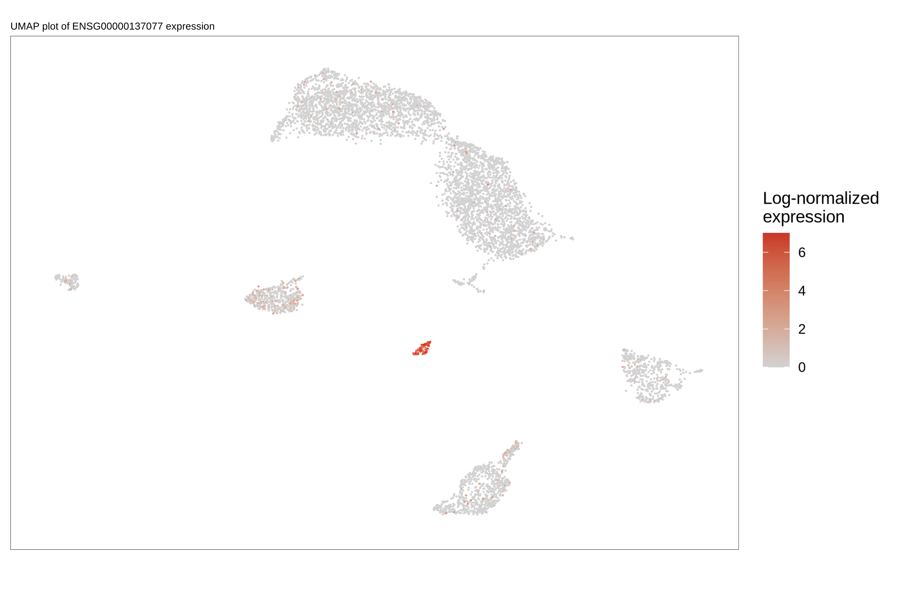
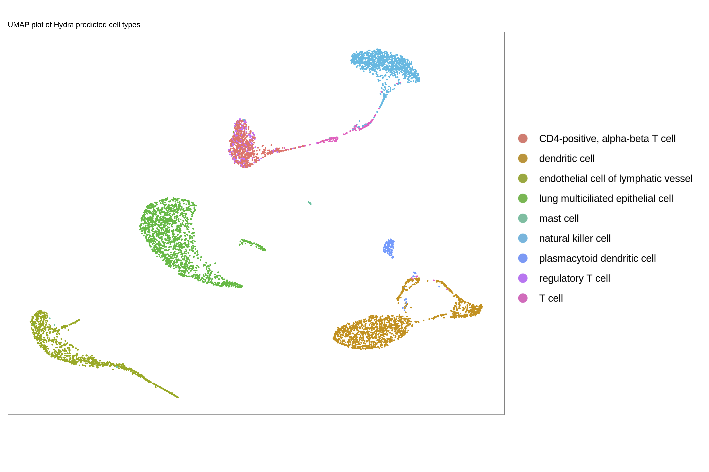
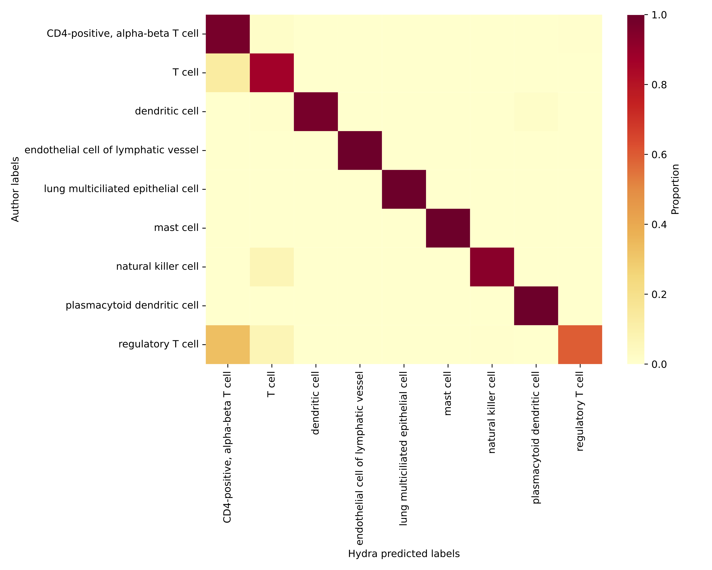

# Single-cell transcriptomics

[](https://pypi.org/project/Hydra-tools/)
[](https://sydneybiox.github.io/Hydra/)


[](https://github.com/SydneyBioX/Hydra?tab=MIT-1-ov-file#readme)


In this tutorial, we will use the example Lung datasets (Madissoon <i>et al</i> and He <i>et al</i>) introduced in the data processing step earlier. In particular, we will explore how to use <code><span style="color: red;">Hydra</span></code> to:

- Select cell-identity genes in a reference scRNA-seq dataset
- Visualize the expression of the selected identity genes
- Perform automated cell type annotation of a query dataset

### **Capturing cell-identity genes**

A key component of <code><span style="color: red;">Hydra</span></code> is selecting features that are specific to the cell type of interest. As an interpretable deep learning-based tool, <code><span style="color: red;">Hydra</span></code> employs a post-hoc feature attribution approach called <a href="
https://doi.org/10.48550/arXiv.1703.01365">Integrated Gradients</a> on the trained VAE models.

After the data processing step, the processed Reference and Query datasets are stored in the directory <code><span style="color: brown;">Input_Processed</span></code>. By default, this directory will be saved in the working directory from where <code><span style="color: red;">Hydra</span></code> was called.

Below is an example of how to run feature selection:

```bash
hydra --setting fs  --base_dir [Path to the directory containing `Input_Processed` directory]
```

<span style="display: block; height: 1px;"></span>

!!! note
    Depending on your GPU memory, you might want to adjust the batch size for feature attribution using the argument <code><span style="color: blue;">attr_batch_size</span></code>. We recommend providing smaller batch sizes with lower GPU memory to avoid CUDA out of memory error (Default: 500, tested on GPU - 24GB memory).


<span style="display: block; height: 1px;"></span>

Running feature selection on our reference dataset - Lung (Madissoon <i>et al</i>).  Since we are running <code><span style="color: blue;">fs</span></code> from the same directory containing the <code><span style="color: brown;">Input_Processed</span></code> directory, we can skip the <code><span style="color: blue;">base_dir</span></code> argument.

```bash
hydra --setting fs
```
<span style="display: block; height: 1px;"></span>

<div style="border-left: 1px solid purple; padding-left: 10px; overflow: auto; font-size: 14px; max-height: 700px">
<pre>
Thank you for using Hydra 😄, an interpretable deep generative tool for single-cell omics. Please refer to the full documentation available at https://sydneybiox.github.io/Hydra/ for detailed usage instructions. If you encounter any issues running the tool - Please open an issue on Github, and we will get back to you as soon as possible!!


===============================

Device to be used: CUDA 

===============================

INFO - 2025-08-10 07:26:12,597 - Starting to run 

INFO - 2025-08-10 07:26:12,597 - Training model... 

INFO - 2025-08-10 07:26:27,691 - The Dataset is: scRNA-seq 

100%|█████████████████████████████████████████████████████████████████████████████████████████████████████████████████████████████████████████████████████████████| 40/40 [00:25<00:00,  1.56it/s]
INFO - 2025-08-10 07:27:15,789 - 

Refining Model: 1 

 55%|██████████████████████████████████████████████████████████████████████████████████████▊                                                                      | 26/47 [00:00<00:00, 44.70it/s]Early stopping at epoch: 29
 60%|█████████████████████████████████████████████████████████████████████████████████████████████▌                                                               | 28/47 [00:00<00:00, 34.50it/s]
INFO - 2025-08-10 07:27:19,113 - 

Refining Model: 2 

 68%|███████████████████████████████████████████████████████████████████████████████████████████████████████████▍                                                 | 26/38 [00:00<00:00, 31.17it/s]Early stopping at epoch: 35
 89%|████████████████████████████████████████████████████████████████████████████████████████████████████████████████████████████████████████████▍                | 34/38 [00:01<00:00, 30.72it/s]
INFO - 2025-08-10 07:27:20,479 - 

Refining Model: 3 

100%|█████████████████████████████████████████████████████████████████████████████████████████████████████████████████████████████████████████████████████████████| 48/48 [00:01<00:00, 37.35it/s]
INFO - 2025-08-10 07:27:22,026 - 

Refining Model: 4 

100%|█████████████████████████████████████████████████████████████████████████████████████████████████████████████████████████████████████████████████████████████| 31/31 [00:01<00:00, 29.37it/s]
INFO - 2025-08-10 07:27:23,329 - 

Refining Model: 5 

 57%|████████████████████████████████████████████████████████████████████████████████████████▉                                                                    | 17/30 [00:00<00:00, 23.28it/s]Early stopping at epoch: 25
 80%|█████████████████████████████████████████████████████████████████████████████████████████████████████████████████████████████▌                               | 24/30 [00:01<00:00, 23.61it/s]
INFO - 2025-08-10 07:27:24,591 - 

Refining Model: 6 

 62%|████████████████████████████████████████████████████████████████████████████████████████████████▊                                                            | 29/47 [00:00<00:00, 43.00it/s]Early stopping at epoch: 30
 62%|████████████████████████████████████████████████████████████████████████████████████████████████▊                                                            | 29/47 [00:00<00:00, 30.83it/s]
INFO - 2025-08-10 07:27:25,782 - 

Refining Model: 7 

100%|█████████████████████████████████████████████████████████████████████████████████████████████████████████████████████████████████████████████████████████████| 40/40 [00:01<00:00, 33.50it/s]
INFO - 2025-08-10 07:27:27,247 - 

Refining Model: 8 

 71%|███████████████████████████████████████████████████████████████████████████████████████████████████████████████▏                                             | 34/48 [00:01<00:00, 42.93it/s]Early stopping at epoch: 36
 73%|██████████████████████████████████████████████████████████████████████████████████████████████████████████████████▍                                          | 35/48 [00:01<00:00, 31.24it/s]
INFO - 2025-08-10 07:27:28,633 - 

Refining Model: 9 

 66%|███████████████████████████████████████████████████████████████████████████████████████████████████████▎                                                     | 25/38 [00:01<00:00, 37.84it/s]Early stopping at epoch: 27
 68%|███████████████████████████████████████████████████████████████████████████████████████████████████████████▍                                                 | 26/38 [00:01<00:00, 25.03it/s]
INFO - 2025-08-10 07:27:29,911 - 

Refining Model: 10 

100%|█████████████████████████████████████████████████████████████████████████████████████████████████████████████████████████████████████████████████████████████| 31/31 [00:01<00:00, 27.28it/s]
INFO - 2025-08-10 07:27:31,291 - 

Refining Model: 11 

100%|█████████████████████████████████████████████████████████████████████████████████████████████████████████████████████████████████████████████████████████████| 50/50 [00:01<00:00, 39.54it/s]
INFO - 2025-08-10 07:27:32,821 - 

Refining Model: 12 

 76%|███████████████████████████████████████████████████████████████████████████████████████████████████████████████████████▌                                     | 32/42 [00:00<00:00, 48.71it/s]Early stopping at epoch: 35
 81%|███████████████████████████████████████████████████████████████████████████████████████████████████████████████████████████████                              | 34/42 [00:00<00:00, 38.05it/s]
INFO - 2025-08-10 07:27:33,986 - 

Refining Model: 13 

 46%|████████████████████████████████████████████████████████████████████████▊                                                                                    | 19/41 [00:00<00:00, 26.95it/s]Early stopping at epoch: 28
 66%|███████████████████████████████████████████████████████████████████████████████████████████████████████▍                                                     | 27/41 [00:00<00:00, 28.61it/s]
INFO - 2025-08-10 07:27:35,198 - 

Refining Model: 14 

 60%|██████████████████████████████████████████████████████████████████████████████████████████████▏                                                              | 21/35 [00:00<00:00, 37.88it/s]Early stopping at epoch: 24
 66%|███████████████████████████████████████████████████████████████████████████████████████████████████████▏                                                     | 23/35 [00:00<00:00, 30.65it/s]
INFO - 2025-08-10 07:27:36,237 - 

Refining Model: 15 

 56%|████████████████████████████████████████████████████████████████████████████████████████▎                                                                    | 27/48 [00:00<00:00, 45.71it/s]Early stopping at epoch: 29
 58%|███████████████████████████████████████████████████████████████████████████████████████████▌                                                                 | 28/48 [00:00<00:00, 32.05it/s]
INFO - 2025-08-10 07:27:37,375 - 

Refining Model: 16 

 82%|████████████████████████████████████████████████████████████████████████████████████████████████████████████████████████████████▍                            | 27/33 [00:00<00:00, 43.76it/s]Early stopping at epoch: 30
 88%|█████████████████████████████████████████████████████████████████████████████████████████████████████████████████████████████████████████▉                   | 29/33 [00:00<00:00, 31.14it/s]
INFO - 2025-08-10 07:27:38,570 - 

Refining Model: 17 

 78%|█████████████████████████████████████████████████████████████████████████████████████████████████████████████████████████▋                                   | 31/40 [00:00<00:00, 48.20it/s]Early stopping at epoch: 34
 82%|█████████████████████████████████████████████████████████████████████████████████████████████████████████████████████████████████▌                           | 33/40 [00:00<00:00, 35.20it/s]
INFO - 2025-08-10 07:27:39,767 - 

Refining Model: 18 

100%|█████████████████████████████████████████████████████████████████████████████████████████████████████████████████████████████████████████████████████████████| 36/36 [00:01<00:00, 33.82it/s]
INFO - 2025-08-10 07:27:41,093 - 

Refining Model: 19 

 65%|█████████████████████████████████████████████████████████████████████████████████████████████████████▌                                                       | 22/34 [00:00<00:00, 31.60it/s]Early stopping at epoch: 30
 85%|█████████████████████████████████████████████████████████████████████████████████████████████████████████████████████████████████████▉                       | 29/34 [00:00<00:00, 32.17it/s]
INFO - 2025-08-10 07:27:42,242 - 

Refining Model: 20 

100%|█████████████████████████████████████████████████████████████████████████████████████████████████████████████████████████████████████████████████████████████| 32/32 [00:00<00:00, 32.98it/s]
INFO - 2025-08-10 07:27:43,457 - 

Refining Model: 21 

 37%|██████████████████████████████████████████████████████████▎                                                                                                  | 13/35 [00:00<00:00, 25.98it/s]Early stopping at epoch: 22
 60%|██████████████████████████████████████████████████████████████████████████████████████████████▏                                                              | 21/35 [00:00<00:00, 31.65it/s]
INFO - 2025-08-10 07:27:44,368 - 

Refining Model: 22 

 62%|██████████████████████████████████████████████████████████████████████████████████████████████████▏                                                          | 25/40 [00:00<00:00, 46.78it/s]Early stopping at epoch: 28
 68%|█████████████████████████████████████████████████████████████████████████████████████████████████████████▉                                                   | 27/40 [00:00<00:00, 35.76it/s]
INFO - 2025-08-10 07:27:45,363 - 

Refining Model: 23 

 70%|██████████████████████████████████████████████████████████████████████████████████████████████████████████████▌                                              | 31/44 [00:00<00:00, 49.81it/s]Early stopping at epoch: 34
 75%|█████████████████████████████████████████████████████████████████████████████████████████████████████████████████████▊                                       | 33/44 [00:00<00:00, 36.71it/s]
INFO - 2025-08-10 07:27:46,519 - 

Refining Model: 24 

100%|█████████████████████████████████████████████████████████████████████████████████████████████████████████████████████████████████████████████████████████████| 30/30 [00:01<00:00, 29.74it/s]
INFO - 2025-08-10 07:27:47,785 - 

Refining Model: 25 

 64%|███████████████████████████████████████████████████████████████████████████████████████████████████▉                                                         | 21/33 [00:00<00:00, 33.83it/s]Early stopping at epoch: 29
 85%|█████████████████████████████████████████████████████████████████████████████████████████████████████████████████████████████████████▏                       | 28/33 [00:00<00:00, 33.51it/s]
INFO - 2025-08-10 07:27:48,887 - 

Running feature selection... 

100%|███████████████████████████████████████████████████████████████████████████████████████████████████████████████████████████████████████████████████████████████| 9/9 [01:18<00:00,  8.77s/it]
INFO - 2025-08-10 07:29:14,545 - Completed successfully! 
</pre>
</div>

<span style="display: block; height: 1px;"></span>

!!! note
    By default, Hydra uses an ensemble size = 25. If you wish to modify the number of models, please use the argument <code><span style="color: blue;">num_models</span></code> while running the tool.


### **Understanding feature selection results**

The feature selection process outputs a set of cell type-specific features along with their corresponding importance scores derived from the reference dataset.

This will be stored in the <code><span style="color: brown;">Feature_Selection</span></code> sub-directory located within the <code><span style="color: brown;">Results</span></code> directory.

<span style="display: block; height: 1px;"></span>
<div style="border-left: 1px solid purple; padding-left: 10px; overflow: auto; font-size: 14px;">
<pre>
Results/
└── Feature_Selection
    └── Hydra-25
        ├── fs.CD4-positive, alpha-beta T cell_Hydra.csv
        ├── fs.dendritic cell_Hydra.csv
        ├── fs.endothelial cell of lymphatic vessel_Hydra.csv
        ├── fs.lung multiciliated epithelial cell_Hydra.csv
        ├── fs.mast cell_Hydra.csv
        ├── fs.natural killer cell_Hydra.csv
        ├── fs.plasmacytoid dendritic cell_Hydra.csv
        ├── fs.regulatory T cell_Hydra.csv
        └── fs.T cell_Hydra.csv
</pre>
</div>

<span style="display: block; height: 1px;"></span>

Below is an example of feature selection results for the cell type - endothelial cell of lymphatic vessel:
<span style="display: block; height: 1px;"></span>

<div style="text-align: center;">
    
</div>

<span style="display: block; height: 1px;"></span>

- By default, <code><span style="color: red;">Hydra</span></code> outputs the importance scores for all genes for each cell type. The genes are ranked based on their scores, with higher scores indicating better ranks. 
- Each row corresponds to a gene, its associated modality and index number in the dataset (Gene_Modality_Index), and its corresponding importance score.

### **Visualizing marker gene expression**

<code><span style="color: red;">Hydra</span></code> allows users to visualize the expression of marker genes directly within a dataset. <code><span style="color: red;">Hydra</span></code> utilizes <a href="https://satijalab.org/seurat/">Seurat</a>, <a href="https://ggplot2.tidyverse.org/">ggplot2</a> and <a href="https://cran.r-project.org/web/packages/ggridges/index.html">ggridges</a> to generate these plots.

<span style="display: block; height: 1px;"></span>

Here, we will visualize the expression of the top gene **ENSG00000137077**.

<span style="display: block; height: 1px;"></span>

<span style="display: block; height: 1px;"></span>

```bash
hydra --setting plot --modality rna --train Lung_Madissoon.h5ad --gene "ENSG00000137077" --ctofinterest "endothelial cell of lymphatic vessel" --celltypecol cell_type
```

<span style="display: block; height: 1px;"></span>

!!! note
    If you want to visualize the marker gene expression in the annotated query dataset, you need to map the cell type labels predicted by Hydra and specify the <code><span style="color: blue;">celltypecol</span></code>

<br>

<div style="border-left: 1px solid purple; padding-left: 10px; overflow: auto; font-size: 14px; max-height: 700px">
<pre>
Thank you for using Hydra 😄, an interpretable deep generative tool for single-cell omics. Please refer to the full documentation available at https://sydneybiox.github.io/Hydra/ for detailed usage instructions. If you encounter any issues running the tool - Please open an issue on Github, and we will get back to you as soon as possible!!


===============================

Device to be used: CUDA 

===============================

INFO - 2025-08-10 19:31:02,010 - Starting to run 

INFO - 2025-08-10 19:31:02,010 - Generating plot... 

Warning: Data is of class matrix. Coercing to dgCMatrix.
Normalizing layer: counts
Performing log-normalization
0%   10   20   30   40   50   60   70   80   90   100%
[----|----|----|----|----|----|----|----|----|----|
**************************************************|
Finding variable features for layer counts
Calculating gene variances
0%   10   20   30   40   50   60   70   80   90   100%
[----|----|----|----|----|----|----|----|----|----|
**************************************************|
Calculating feature variances of standardized and clipped values
0%   10   20   30   40   50   60   70   80   90   100%
[----|----|----|----|----|----|----|----|----|----|
**************************************************|
Centering and scaling data matrix
  |======================================================================| 100%
PC_ 1 
Positive:  ENSG00000075624, ENSG00000275302, ENSG00000115523, ENSG00000158050, ENSG00000100906, ENSG00000090104, ENSG00000034510, ENSG00000111537, ENSG00000158869, ENSG00000116741 
           ENSG00000227507, ENSG00000143185, ENSG00000277632, ENSG00000132965, ENSG00000011600, ENSG00000143184, ENSG00000023445, ENSG00000276070, ENSG00000147872, ENSG00000109861 
           ENSG00000134333, ENSG00000136732, ENSG00000188404, ENSG00000186891, ENSG00000170345, ENSG00000100097, ENSG00000111640, ENSG00000109321, ENSG00000026025, ENSG00000134545 
Negative:  ENSG00000124237, ENSG00000117472, ENSG00000179902, ENSG00000186973, ENSG00000164972, ENSG00000160188, ENSG00000267795, ENSG00000173947, ENSG00000159713, ENSG00000160345 
           ENSG00000188817, ENSG00000215217, ENSG00000183644, ENSG00000185681, ENSG00000133640, ENSG00000168589, ENSG00000105519, ENSG00000152611, ENSG00000173467, ENSG00000153789 
           ENSG00000166959, ENSG00000188010, ENSG00000174844, ENSG00000160401, ENSG00000154099, ENSG00000136918, ENSG00000089356, ENSG00000162004, ENSG00000004838, ENSG00000188931 
PC_ 2 
Positive:  ENSG00000101439, ENSG00000127920, ENSG00000137077, ENSG00000110841, ENSG00000196735, ENSG00000198502, ENSG00000030582, ENSG00000138722, ENSG00000003436, ENSG00000260314 
           ENSG00000223865, ENSG00000162493, ENSG00000110077, ENSG00000132514, ENSG00000249751, ENSG00000147113, ENSG00000173267, ENSG00000204287, ENSG00000148671, ENSG00000179344 
           ENSG00000143226, ENSG00000178726, ENSG00000140749, ENSG00000277443, ENSG00000117707, ENSG00000231389, ENSG00000204472, ENSG00000204257, ENSG00000196126, ENSG00000066336 
Negative:  ENSG00000115523, ENSG00000124237, ENSG00000186973, ENSG00000179902, ENSG00000164972, ENSG00000215217, ENSG00000185681, ENSG00000160188, ENSG00000173947, ENSG00000111537 
           ENSG00000188817, ENSG00000267795, ENSG00000105519, ENSG00000160345, ENSG00000183644, ENSG00000231621, ENSG00000152611, ENSG00000168589, ENSG00000143185, ENSG00000136918 
           ENSG00000117472, ENSG00000174844, ENSG00000188931, ENSG00000153789, ENSG00000160401, ENSG00000172426, ENSG00000004838, ENSG00000133640, ENSG00000162004, ENSG00000173467 
PC_ 3 
Positive:  ENSG00000196735, ENSG00000110077, ENSG00000132514, ENSG00000179344, ENSG00000204287, ENSG00000140749, ENSG00000198502, ENSG00000204472, ENSG00000231389, ENSG00000204257 
           ENSG00000223865, ENSG00000072694, ENSG00000196126, ENSG00000242574, ENSG00000158481, ENSG00000066336, ENSG00000114013, ENSG00000163563, ENSG00000204482, ENSG00000143226 
           ENSG00000169429, ENSG00000019582, ENSG00000166920, ENSG00000090382, ENSG00000106066, ENSG00000135549, ENSG00000125538, ENSG00000112799, ENSG00000172243, ENSG00000159189 
Negative:  ENSG00000138722, ENSG00000137077, ENSG00000127920, ENSG00000173267, ENSG00000249751, ENSG00000162493, ENSG00000003436, ENSG00000160180, ENSG00000147113, ENSG00000110841 
           ENSG00000267107, ENSG00000117707, ENSG00000148671, ENSG00000122786, ENSG00000169908, ENSG00000184113, ENSG00000131477, ENSG00000188643, ENSG00000068001, ENSG00000137962 
           ENSG00000137726, ENSG00000037280, ENSG00000185551, ENSG00000170365, ENSG00000105974, ENSG00000075213, ENSG00000163762, ENSG00000024422, ENSG00000172889, ENSG00000267583 
PC_ 4 
Positive:  ENSG00000115523, ENSG00000075624, ENSG00000275302, ENSG00000277632, ENSG00000034510, ENSG00000143185, ENSG00000158050, ENSG00000111537, ENSG00000109861, ENSG00000019582 
           ENSG00000160932, ENSG00000136732, ENSG00000140968, ENSG00000143184, ENSG00000227507, ENSG00000276085, ENSG00000134333, ENSG00000276070, ENSG00000182718, ENSG00000197747 
           ENSG00000166794, ENSG00000221869, ENSG00000150687, ENSG00000188404, ENSG00000143870, ENSG00000134545, ENSG00000084207, ENSG00000163453, ENSG00000231389, ENSG00000180817 
Negative:  ENSG00000172236, ENSG00000197253, ENSG00000163751, ENSG00000163106, ENSG00000179348, ENSG00000149534, ENSG00000164120, ENSG00000263961, ENSG00000157404, ENSG00000110002 
           ENSG00000127074, ENSG00000140287, ENSG00000106565, ENSG00000233968, ENSG00000135678, ENSG00000160789, ENSG00000120885, ENSG00000042493, ENSG00000267453, ENSG00000073756 
           ENSG00000010278, ENSG00000073737, ENSG00000068697, ENSG00000128342, ENSG00000167996, ENSG00000116741, ENSG00000135404, ENSG00000179639, ENSG00000168952, ENSG00000002933 
PC_ 5 
Positive:  ENSG00000138722, ENSG00000160180, ENSG00000147113, ENSG00000249751, ENSG00000117707, ENSG00000163762, ENSG00000267107, ENSG00000137077, ENSG00000110841, ENSG00000137962 
           ENSG00000170323, ENSG00000173267, ENSG00000267583, ENSG00000168497, ENSG00000170365, ENSG00000037280, ENSG00000118257, ENSG00000277443, ENSG00000154133, ENSG00000179776 
           ENSG00000185551, ENSG00000178726, ENSG00000075213, ENSG00000184113, ENSG00000169908, ENSG00000184058, ENSG00000154330, ENSG00000172889, ENSG00000127920, ENSG00000164849 
Negative:  ENSG00000108821, ENSG00000118849, ENSG00000011465, ENSG00000077942, ENSG00000164647, ENSG00000164692, ENSG00000168542, ENSG00000109846, ENSG00000116132, ENSG00000124212 
           ENSG00000142156, ENSG00000139329, ENSG00000188257, ENSG00000205362, ENSG00000167779, ENSG00000129009, ENSG00000111341, ENSG00000134853, ENSG00000197766, ENSG00000113140 
           ENSG00000004776, ENSG00000162576, ENSG00000106333, ENSG00000091986, ENSG00000109610, ENSG00000157613, ENSG00000112936, ENSG00000140285, ENSG00000163520, ENSG00000174807 
Warning: The default method for RunUMAP has changed from calling Python UMAP via reticulate to the R-native UWOT using the cosine metric
To use Python UMAP via reticulate, set umap.method to 'umap-learn' and metric to 'correlation'
This message will be shown once per session
19:31:17 UMAP embedding parameters a = 0.9922 b = 1.112
19:31:17 Read 5950 rows and found 10 numeric columns
19:31:17 Using Annoy for neighbor search, n_neighbors = 30
19:31:17 Building Annoy index with metric = cosine, n_trees = 50
0%   10   20   30   40   50   60   70   80   90   100%
[----|----|----|----|----|----|----|----|----|----|
**************************************************|
19:31:17 Writing NN index file to temp file /tmp/RtmpSm0msP/file3e8b8a7a56378a
19:31:17 Searching Annoy index using 1 thread, search_k = 3000
19:31:19 Annoy recall = 100%
19:31:19 Commencing smooth kNN distance calibration using 1 thread with target n_neighbors = 30
19:31:19 Initializing from normalized Laplacian + noise (using RSpectra)
19:31:20 Commencing optimization for 500 epochs, with 249888 positive edges
19:31:20 Using rng type: pcg
Using method 'umap'
0%   10   20   30   40   50   60   70   80   90   100%
[----|----|----|----|----|----|----|----|----|----|
**************************************************|
19:31:25 Optimization finished
Scale for colour is already present.
Adding another scale for colour, which will replace the existing scale.
Picking joint bandwidth of 0.196
INFO - 2025-08-10 19:31:27,272 - Completed successfully!
</pre>
</div>

<span style="display: block; height: 1px;"></span>

The <code><span style="color: blue;">gene</span></code> and <code><span style="color: blue;">ctofinterest</span></code> arguments are optional. If you run <code><span style="color: red;">Hydra</span></code> without these arguments, only a UMAP plot of the dataset will be generated.

<div style="text-align: center;">
    
</div>

<span style="display: block; height: 1px;"></span>

The <code><span style="color: blue;">gene</span></code> argument highlights the expression of a specified gene across all cell types on the UMAP plot.

<div style="text-align: center;">
    
</div>

<span style="display: block; height: 1px;"></span>

The <code><span style="color: blue;">ctofinterest</span></code> argument generates a ridgeline plot showing the expression of the specified gene in the cell type of interest versus all other cell types.

<div style="padding-left: 80px;"> 
    
</div>

<span style="display: block; height: 1px;"></span>

The plots generated will be stored in the directory <code><span style="color: brown;">Results/Plots</span></code>.

### **Automated cell type annotation**

Another key component of <code><span style="color: red;">Hydra</span></code> is an automated cell type annotation module. We will use the setting <code><span style="color: blue;">annotation</span></code> to annotate the query dataset.

<span style="display: block; height: 1px;"></span>

!!! note
    You need to run feature selection (<code><span style="color: blue;">fs</span></code>) on the reference datatset before annotating the query. If you have already run feature selection on the reference & want to annotate (<code><span style="color: blue;">annotation</span></code>) a different related query dataset, please process the data (<code><span style="color: blue;">processdata</span></code>) first and then provide the path to the directory containing this processed data.


<span style="display: block; height: 1px;"></span>

In this example, we will annotate the Lung dataset (He <i>et al</i>) introduced earlier. Since we are running <code><span style="color: blue;">fs</span></code> from the same directory containing the <code><span style="color: brown;">Input_Processed</span></code> directory, we can skip the <code><span style="color: blue;">base_dir</span></code> argument.

```bash
hydra --setting annotation
```

<span style="display: block; height: 1px;"></span>

<div style="border-left: 1px solid purple; padding-left: 10px; overflow: auto; font-size: 14px; max-height: 700px">
<pre>
Thank you for using Hydra 😄, an interpretable deep generative tool for single-cell omics. Please refer to the full documentation available at https://sydneybiox.github.io/Hydra/ for detailed usage instructions. If you encounter any issues running the tool - Please open an issue on Github, and we will get back to you as soon as possible!!


===============================

Device to be used: CUDA 

===============================

INFO - 2025-08-10 19:52:13,972 - Starting to run 

Device to be used:  cuda 

INFO - 2025-08-10 19:52:16,352 - Training classifier: 1 

100%|█████████████████████████████████████████████████████████████████████████| 5/5 [00:09<00:00,  1.87s/it]
INFO - 2025-08-10 19:53:08,709 - Training classifier: 2 

100%|█████████████████████████████████████████████████████████████████████████| 5/5 [00:00<00:00, 70.58it/s]
INFO - 2025-08-10 19:53:11,426 - Training classifier: 3 

100%|█████████████████████████████████████████████████████████████████████████| 5/5 [00:00<00:00, 71.25it/s]
INFO - 2025-08-10 19:53:13,269 - Training classifier: 4 

100%|█████████████████████████████████████████████████████████████████████████| 5/5 [00:00<00:00, 69.50it/s]
INFO - 2025-08-10 19:53:15,711 - Training classifier: 5 

100%|█████████████████████████████████████████████████████████████████████████| 5/5 [00:00<00:00, 61.14it/s]
INFO - 2025-08-10 19:53:17,226 - Training classifier: 6 

100%|█████████████████████████████████████████████████████████████████████████| 5/5 [00:00<00:00, 61.22it/s]
INFO - 2025-08-10 19:53:19,323 - Training classifier: 7 

100%|█████████████████████████████████████████████████████████████████████████| 5/5 [00:00<00:00, 66.35it/s]
INFO - 2025-08-10 19:53:21,421 - Training classifier: 8 

100%|█████████████████████████████████████████████████████████████████████████| 5/5 [00:00<00:00, 60.45it/s]
INFO - 2025-08-10 19:53:23,181 - Training classifier: 9 

100%|█████████████████████████████████████████████████████████████████████████| 5/5 [00:00<00:00, 60.71it/s]
INFO - 2025-08-10 19:53:25,759 - Training classifier: 10 

100%|█████████████████████████████████████████████████████████████████████████| 5/5 [00:00<00:00, 70.00it/s]
INFO - 2025-08-10 19:53:28,174 - Training classifier: 11 

100%|█████████████████████████████████████████████████████████████████████████| 5/5 [00:00<00:00, 69.72it/s]
INFO - 2025-08-10 19:53:30,902 - Training classifier: 12 

100%|█████████████████████████████████████████████████████████████████████████| 5/5 [00:00<00:00, 69.22it/s]
INFO - 2025-08-10 19:53:33,107 - Training classifier: 13 

100%|█████████████████████████████████████████████████████████████████████████| 5/5 [00:00<00:00, 69.46it/s]
INFO - 2025-08-10 19:53:35,200 - Training classifier: 14 

100%|█████████████████████████████████████████████████████████████████████████| 5/5 [00:00<00:00, 68.02it/s]
INFO - 2025-08-10 19:53:37,760 - Training classifier: 15 

100%|█████████████████████████████████████████████████████████████████████████| 5/5 [00:00<00:00, 70.47it/s]
INFO - 2025-08-10 19:53:40,618 - Training classifier: 16 

100%|█████████████████████████████████████████████████████████████████████████| 5/5 [00:00<00:00, 68.59it/s]
INFO - 2025-08-10 19:53:42,993 - Training classifier: 17 

100%|█████████████████████████████████████████████████████████████████████████| 5/5 [00:00<00:00, 69.41it/s]
INFO - 2025-08-10 19:53:45,198 - Training classifier: 18 

100%|█████████████████████████████████████████████████████████████████████████| 5/5 [00:00<00:00, 69.64it/s]
INFO - 2025-08-10 19:53:46,947 - Training classifier: 19 

100%|█████████████████████████████████████████████████████████████████████████| 5/5 [00:00<00:00, 70.02it/s]
INFO - 2025-08-10 19:53:48,458 - Training classifier: 20 

100%|█████████████████████████████████████████████████████████████████████████| 5/5 [00:00<00:00, 69.59it/s]
INFO - 2025-08-10 19:53:49,924 - Training classifier: 21 

100%|█████████████████████████████████████████████████████████████████████████| 5/5 [00:00<00:00, 69.37it/s]
INFO - 2025-08-10 19:53:52,444 - Training classifier: 22 

100%|█████████████████████████████████████████████████████████████████████████| 5/5 [00:00<00:00, 71.17it/s]
INFO - 2025-08-10 19:53:54,682 - Training classifier: 23 

100%|█████████████████████████████████████████████████████████████████████████| 5/5 [00:00<00:00, 69.72it/s]
INFO - 2025-08-10 19:53:57,157 - Training classifier: 24 

100%|█████████████████████████████████████████████████████████████████████████| 5/5 [00:00<00:00, 70.59it/s]
INFO - 2025-08-10 19:53:59,812 - Training classifier: 25 

100%|█████████████████████████████████████████████████████████████████████████| 5/5 [00:00<00:00, 71.28it/s]
INFO - 2025-08-10 19:54:02,705 - Annotating the query dataset... 

INFO - 2025-08-10 19:54:22,460 - Completed successfully!  
</pre>
</div>

<span style="display: block; height: 1px;"></span>

!!! note
    The number of classifiers should be equal to the number of models (Ensemble size) used in the feature selection step. If you have changed the ensemble size, then you need to provide an additional argument <code><span style="color: blue;">num_classifiers</span></code> when calling the annotation setting.

<span style="display: block; height: 1px;"></span>

The annotation results generated will be stored in the directory <code><span style="color: brown;">Results/Annotation</span></code>.

<span style="display: block; height: 1px;"></span>

### **Plotting cell type predictions**

<code><span style="color: red;">Hydra</span></code> also allows users to visualize the predicted labels on the UMAP plot. We will use the Hydra predicted labels for the Lung dataset (He <i>et al</i>):

```bash
hydra --setting plot --predictions True --test Lung_He.h5ad --modality rna --ctpredictions Results/Annotation/Hydra-25/cell_type_predicted_Hydra-25.csv
```
<span style="display: block; height: 1px;"></span>

<div style="border-left: 1px solid purple; padding-left: 10px; overflow: auto; font-size: 14px; max-height: 700px">
<pre>
Thank you for using Hydra 😄, an interpretable deep generative tool for single-cell omics. Please refer to the full documentation available at https://sydneybiox.github.io/Hydra/ for detailed usage instructions. If you encounter any issues running the tool - Please open an issue on Github, and we will get back to you as soon as possible!!


===============================

Device to be used: CUDA 

===============================

INFO - 2025-08-10 20:08:55,945 - Starting to run 

INFO - 2025-08-10 20:08:55,945 - Generating plot for Hydra predicted cell types... 

Warning: Data is of class matrix. Coercing to dgCMatrix.
Normalizing layer: counts
Performing log-normalization
0%   10   20   30   40   50   60   70   80   90   100%
[----|----|----|----|----|----|----|----|----|----|
**************************************************|
Finding variable features for layer counts
Calculating gene variances
0%   10   20   30   40   50   60   70   80   90   100%
[----|----|----|----|----|----|----|----|----|----|
**************************************************|
Calculating feature variances of standardized and clipped values
0%   10   20   30   40   50   60   70   80   90   100%
[----|----|----|----|----|----|----|----|----|----|
**************************************************|
Centering and scaling data matrix
  |======================================================================| 100%
PC_ 1 
Positive:  ENSG00000124237, ENSG00000186973, ENSG00000160188, ENSG00000105519, ENSG00000164972, ENSG00000173947, ENSG00000159713, ENSG00000173467, ENSG00000160345, ENSG00000215217 
           ENSG00000004838, ENSG00000179902, ENSG00000188817, ENSG00000160401, ENSG00000162004, ENSG00000153789, ENSG00000168589, ENSG00000183644, ENSG00000152611, ENSG00000117472 
           ENSG00000174844, ENSG00000172361, ENSG00000188010, ENSG00000188931, ENSG00000034239, ENSG00000167858, ENSG00000133640, ENSG00000166165, ENSG00000257057, ENSG00000166959 
Negative:  ENSG00000034510, ENSG00000075624, ENSG00000111640, ENSG00000026025, ENSG00000122862, ENSG00000103187, ENSG00000196230, ENSG00000136732, ENSG00000087086, ENSG00000100097 
           ENSG00000127528, ENSG00000167460, ENSG00000011600, ENSG00000204472, ENSG00000158050, ENSG00000100906, ENSG00000175130, ENSG00000019582, ENSG00000102265, ENSG00000169442 
           ENSG00000115956, ENSG00000132965, ENSG00000090104, ENSG00000110848, ENSG00000168209, ENSG00000137509, ENSG00000164687, ENSG00000231389, ENSG00000223865, ENSG00000112149 
PC_ 2 
Positive:  ENSG00000003436, ENSG00000137077, ENSG00000188643, ENSG00000131477, ENSG00000172889, ENSG00000114115, ENSG00000127920, ENSG00000184113, ENSG00000110841, ENSG00000168497 
           ENSG00000112769, ENSG00000117707, ENSG00000122786, ENSG00000100234, ENSG00000141753, ENSG00000177469, ENSG00000160180, ENSG00000117519, ENSG00000118257, ENSG00000037280 
           ENSG00000138722, ENSG00000066056, ENSG00000117122, ENSG00000163453, ENSG00000128052, ENSG00000187498, ENSG00000134871, ENSG00000152661, ENSG00000179776, ENSG00000137726 
Negative:  ENSG00000122862, ENSG00000011600, ENSG00000158050, ENSG00000204472, ENSG00000115956, ENSG00000090104, ENSG00000196154, ENSG00000110848, ENSG00000169442, ENSG00000153234 
           ENSG00000019582, ENSG00000137309, ENSG00000185885, ENSG00000265206, ENSG00000204287, ENSG00000143110, ENSG00000141682, ENSG00000196126, ENSG00000179344, ENSG00000204482 
           ENSG00000132965, ENSG00000196735, ENSG00000112149, ENSG00000198502, ENSG00000160593, ENSG00000066336, ENSG00000123358, ENSG00000204257, ENSG00000231389, ENSG00000121966 
PC_ 3 
Positive:  ENSG00000101439, ENSG00000223865, ENSG00000231389, ENSG00000196126, ENSG00000204287, ENSG00000198502, ENSG00000196735, ENSG00000179344, ENSG00000204257, ENSG00000066336 
           ENSG00000242574, ENSG00000127951, ENSG00000172243, ENSG00000101336, ENSG00000132514, ENSG00000129226, ENSG00000106066, ENSG00000163563, ENSG00000204482, ENSG00000019582 
           ENSG00000182578, ENSG00000166428, ENSG00000112799, ENSG00000140749, ENSG00000120708, ENSG00000197629, ENSG00000169413, ENSG00000160593, ENSG00000100079, ENSG00000161921 
Negative:  ENSG00000185885, ENSG00000197540, ENSG00000145649, ENSG00000211772, ENSG00000211751, ENSG00000167286, ENSG00000198851, ENSG00000105374, ENSG00000111796, ENSG00000172543 
           ENSG00000110848, ENSG00000180644, ENSG00000007264, ENSG00000077984, ENSG00000134539, ENSG00000100385, ENSG00000171476, ENSG00000183918, ENSG00000008517, ENSG00000213658 
           ENSG00000160654, ENSG00000271503, ENSG00000134545, ENSG00000027869, ENSG00000143185, ENSG00000143184, ENSG00000073861, ENSG00000115523, ENSG00000169583, ENSG00000198574 
PC_ 4 
Positive:  ENSG00000175063, ENSG00000131747, ENSG00000148773, ENSG00000170312, ENSG00000137804, ENSG00000089685, ENSG00000088325, ENSG00000178999, ENSG00000237649, ENSG00000145386 
           ENSG00000075218, ENSG00000134690, ENSG00000066279, ENSG00000117724, ENSG00000157456, ENSG00000100526, ENSG00000126787, ENSG00000111665, ENSG00000166851, ENSG00000109805 
           ENSG00000176890, ENSG00000169607, ENSG00000121152, ENSG00000072571, ENSG00000123485, ENSG00000115163, ENSG00000117399, ENSG00000122952, ENSG00000143228, ENSG00000142945 
Negative:  ENSG00000169583, ENSG00000111796, ENSG00000197540, ENSG00000115523, ENSG00000077984, ENSG00000100385, ENSG00000180644, ENSG00000134539, ENSG00000145649, ENSG00000171476 
           ENSG00000271503, ENSG00000185885, ENSG00000275302, ENSG00000203747, ENSG00000117281, ENSG00000110848, ENSG00000105374, ENSG00000134545, ENSG00000198574, ENSG00000150045 
           ENSG00000159674, ENSG00000172543, ENSG00000211751, ENSG00000111537, ENSG00000073861, ENSG00000007264, ENSG00000180739, ENSG00000132002, ENSG00000158050, ENSG00000143185 
PC_ 5 
Positive:  ENSG00000227507, ENSG00000138795, ENSG00000126353, ENSG00000139193, ENSG00000152495, ENSG00000168685, ENSG00000110448, ENSG00000173114, ENSG00000081059, ENSG00000089012 
           ENSG00000137078, ENSG00000172005, ENSG00000188404, ENSG00000102245, ENSG00000013725, ENSG00000178562, ENSG00000072163, ENSG00000116824, ENSG00000163600, ENSG00000169442 
           ENSG00000165272, ENSG00000090554, ENSG00000078596, ENSG00000135426, ENSG00000163519, ENSG00000198851, ENSG00000069493, ENSG00000277734, ENSG00000064886, ENSG00000008517 
Negative:  ENSG00000105374, ENSG00000077984, ENSG00000134539, ENSG00000172543, ENSG00000171476, ENSG00000275302, ENSG00000111796, ENSG00000203747, ENSG00000180644, ENSG00000134545 
           ENSG00000143185, ENSG00000271503, ENSG00000115523, ENSG00000011600, ENSG00000198574, ENSG00000143184, ENSG00000073861, ENSG00000180739, ENSG00000277632, ENSG00000169583 
           ENSG00000115956, ENSG00000150045, ENSG00000100450, ENSG00000117281, ENSG00000163508, ENSG00000211829, ENSG00000100453, ENSG00000100385, ENSG00000111537, ENSG00000007264 
Warning: The default method for RunUMAP has changed from calling Python UMAP via reticulate to the R-native UWOT using the cosine metric
To use Python UMAP via reticulate, set umap.method to 'umap-learn' and metric to 'correlation'
This message will be shown once per session
20:09:14 UMAP embedding parameters a = 0.9922 b = 1.112
20:09:14 Read 6483 rows and found 10 numeric columns
20:09:14 Using Annoy for neighbor search, n_neighbors = 30
20:09:14 Building Annoy index with metric = cosine, n_trees = 50
0%   10   20   30   40   50   60   70   80   90   100%
[----|----|----|----|----|----|----|----|----|----|
**************************************************|
20:09:14 Writing NN index file to temp file /tmp/RtmpU0dZPV/file3ef8bc449f0c19
20:09:14 Searching Annoy index using 1 thread, search_k = 3000
20:09:16 Annoy recall = 100%
20:09:16 Commencing smooth kNN distance calibration using 1 thread with target n_neighbors = 30
20:09:16 Initializing from normalized Laplacian + noise (using RSpectra)
20:09:18 Commencing optimization for 500 epochs, with 260692 positive edges
20:09:18 Using rng type: pcg
Using method 'umap'
0%   10   20   30   40   50   60   70   80   90   100%
[----|----|----|----|----|----|----|----|----|----|
**************************************************|
20:09:24 Optimization finished
INFO - 2025-08-10 20:09:24,813 - Completed successfully!
</pre>
</div>
<br>

Below is an example of UMAP of <code><span style="color: red;">Hydra</span></code> predicted cell types for the Lung dataset (He <i>et al</i>):

<span style="display: block; height: 1px;"></span>

<div style="text-align: center;">
    
</div>

<span style="display: block; height: 1px;"></span>

Below, we include an external figure showing the agreement between Hydra predicted cell type labels and the authors’ labels

<div style="text-align: center;">
  
</div>

<span style="display: block; height: 1px;"></span>

<br>

---
<p style="text-align: left; font-size: 15px">
  Documentation by <a href="http://manojmw.github.io" target="_blank">Manoj M Wagle</a>
</p>

